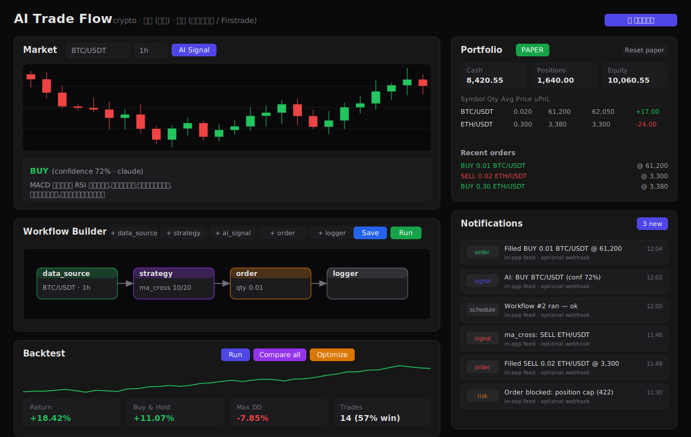
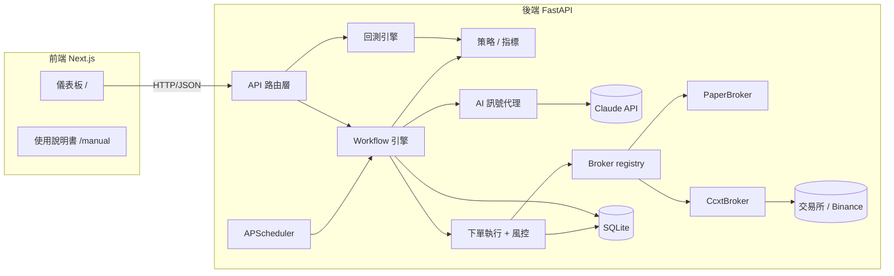
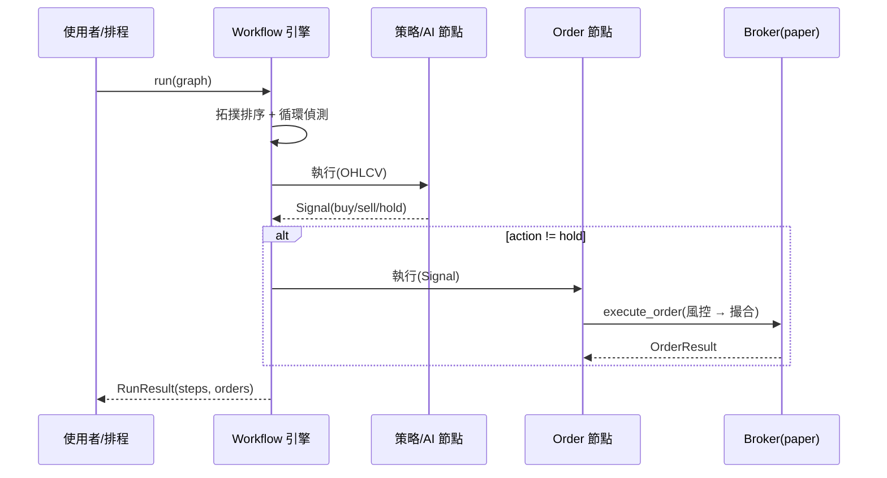

# ai-trade-flow-platform

AI 驅動的自動交易平台 — supports crypto / 台股 / 美股 programmatic trading behind a single
broker abstraction, with technical-indicator strategies, LLM (Claude) signal generation, a
strategy backtester, scheduled (auto-running) workflows, order/signal notifications, and a
workflow-based web UI.

> Development is governed by [`CLAUDE.md`](./CLAUDE.md). Read it before contributing.

## 系統截圖 / Screenshot

視覺化儀表板:即時 K 線 + AI 訊號、節點式工作流編輯器、策略回測、投組與即時通知。



> 圖為單頁儀表板(深色主題)。圖文並茂的互動操作指南請啟動前端後開啟
> [`/manual`](http://localhost:3000/manual)。

## 功能 / Features

| 功能 | 說明 |
| --- | --- |
| 📈 **即時行情 + AI 訊號** | `Market` 面板輸入代號看 K 線(`lightweight-charts`),一鍵「AI Signal」把行情摘要交給 **Claude**,回傳結構化 buy/sell/hold、信心度與白話理由。 |
| 🧩 **節點式工作流** | `Workflow Builder`(React Flow)拖拉節點串成 `Data Source → 策略 / AI → Order → Logger`,可即時 **Run** 或 **Save** 後排程。 |
| 🧠 **技術指標策略** | 內建 `ma_cross` / `rsi` / `macd` / `bollinger`,以 [`ta`](https://github.com/bukosabino/ta) 計算;策略與 AI 同樣輸出 `Signal`,在工作流中可互換。 |
| 🔬 **回測 / 比較 / 最佳化** | `Backtest` 面板單一回測看權益曲線與指標(報酬、Buy&Hold、最大回撤、勝率),一鍵 **Compare all** 多策略排名,**Optimize** 對參數做網格搜尋並一鍵套用最佳值。 |
| ⏱️ **排程自動執行** | `Schedules` 面板把已存工作流交給後端 **APScheduler** 定時觸發,可 running/paused 切換與監看最後狀態。 |
| 💼 **投組 / 紙上交易** | `Portfolio` 面板顯示現金、部位、權益、未實現損益與最近訂單;紙上帳戶狀態跨重啟持久化,可一鍵重置。 |
| 🔔 **通知** | 成交與訊號即時推送到站內訊息流,並可選擇外送 **webhook**。 |
| 🛡️ **風控 + Fail Loud** | 每筆下單前經 `RiskGuard` 檢查單筆金額與部位上限;缺資料 / 外部錯誤 / 違規一律明確回報(非靜默略過)。 |
| 🔌 **多市場 Broker 抽象** | 單一 `Broker` 介面同時是「紙上 vs 真實」與「不同市場」的接縫;台股/美股可匯入 OHLCV CSV 做離線回測與紙上交易。 |

## Status

This is an in-progress build. The **first fully-working end-to-end slice is crypto + paper
trading** (Binance via `ccxt`). The architecture is designed so additional markets/brokers plug
in behind the common `Broker` interface:

| Market | Broker target            | Status                                            |
| ------ | ------------------------ | ------------------------------------------------- |
| Crypto | Binance (`ccxt`)         | ✅ market data + paper trading (live opt-in)      |
| 台股   | 元大證券 (Yuanta)        | ⏳ live scaffold (fail-loud); ✅ offline paper/backtest via CSV import |
| 美股   | 元大複委託 + Firstrade   | ⏳ live scaffold (fail-loud); ✅ offline paper/backtest via CSV import (Firstrade = unofficial API) |

## 架構圖 / Architecture

```
backend/   FastAPI + ccxt + ta + anthropic + SQLModel
frontend/  Next.js (App Router) + TypeScript + React Flow + lightweight-charts
```

使用者(或排程器)觸發 **Workflow 引擎**,引擎依序執行節點:抓行情 → 產生訊號(技術指標或
AI)→ 經風控後下單。所有下單都走統一的 **Broker** 介面,可在「紙上/真實」與「不同市場」間切換。



**核心接縫:** `backend/app/brokers/base.py` 的 `Broker` ABC 是 paper/live 與各市場之間唯一的邊界
— 新增市場或切換模式只需新增子類別並在 `registry.py` 註冊,其餘程式不動。下單路徑也單一化於
`trading/execution.py:execute_order`(手動與工作流共用)。

一條工作流的執行流程:



> 更完整的架構說明、類別圖與資料模型見 [`docs/architecture.md`](./docs/architecture.md)。

## Quick start

### 1. Configure secrets

```bash
cp .env.example .env
# edit .env — set ANTHROPIC_API_KEY for AI nodes; TRADING_MODE defaults to "paper" (safe).
```

### 2. Run with Docker

```bash
docker compose up --build
# backend  -> http://localhost:8000  (docs at /docs)
# frontend -> http://localhost:3000
```

For a production-like local deployment with baked images, health checks, and persistent local SQLite:

```bash
docker compose -f docker-compose.local.yml up -d --build
```

See [`docs/local-deployment.md`](./docs/local-deployment.md) for health checks, kill-switch/halt
dry-run steps, logs, and rollback/reset commands.

### 3. Run locally (without Docker)

Backend:

```bash
cd backend
python -m venv .venv && source .venv/bin/activate
pip install -e ".[dev]"
uvicorn app.main:app --reload
pytest            # business-logic tests
```

Frontend:

```bash
cd frontend
npm install
npm run dev
```

## Safety

- `TRADING_MODE=paper` is the default. Live crypto trading requires `TRADING_MODE=live` **and**
  valid exchange API keys; `risk.py` enforces position-size / max-loss guards before any live
  order is sent.
- Secrets are read only from `.env` (git-ignored). Never hardcode keys.
- **API auth (M0.7):** all `/api/*` routes require `Authorization: Bearer <API_TOKEN>` (`GET /health`
  stays public); CORS origins come from `API_CORS_ORIGINS` (no more `"*"`). A blank `API_TOKEN`
  disables auth for local dev/tests and logs a loud warning — set a strong token for any networked
  deployment. See [`docs/configuration.md`](./docs/configuration.md).
- **Exchange keys:** create Binance API keys with **withdrawals DISABLED** and an **IP allowlist**;
  use a **read-only** key for market data and a separate **trade-only, locked-down** key for orders.

## Documentation

- **Developer docs** (architecture, API, modules, dev log): [`docs/`](./docs/README.md) — diagrams
  render on GitHub.
- **End-user manual** (illustrated, 圖文並茂): run the frontend and open
  [`/manual`](http://localhost:3000/manual).
- The dashboard screenshot above is a self-contained SVG generated by
  [`docs/images/_generate.py`](./docs/images/_generate.py) (no binary image assets, matching the
  project convention).

## Notes

- Technical indicators use the [`ta`](https://github.com/bukosabino/ta) library (stable under
  NumPy 2.x) rather than `pandas-ta`, to keep a fresh install reliable.
</content>
