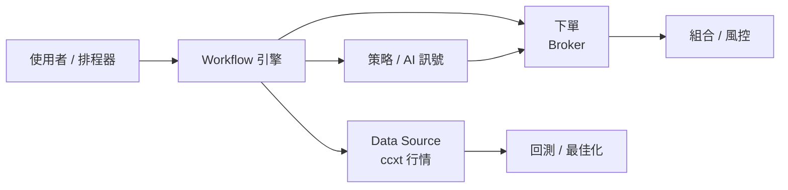

# 技術文件 / Technical Documentation

`ai-trade-flow-platform` 的完整技術文件。本目錄涵蓋架構、各模組、API、開發歷程與測試。
所有圖表使用 [Mermaid](https://mermaid.js.org/)(GitHub 原生渲染)。

> 面向終端使用者的「圖文並茂使用說明書」是 Web 頁面:啟動前端後開啟 **`/manual`**
> (`http://localhost:3000/manual`)。本目錄是面向開發者的技術文件。

## 文件清單(所有過程文件)

### 規格與規劃 / Specs & Planning
| 文件 | 內容 |
| --- | --- |
| [`PRD-v2.md`](./PRD-v2.md) | **v2 產品需求文件**:Phase 0/1/2 各 milestone、驗收標準、鐵則、已確認決定(基準幣別 TWD、元大 SPARK、美股 signal-only) |
| [`task-backlog.md`](./task-backlog.md) | **任務總表與路線圖**:v1+v2 所有任務,依 effort(low/medium)分類,含項目名稱/內容/修改位置與完成狀態(✅/⬜)——判斷「做到哪裡」的單一事實來源 |
| [`development-log.md`](./development-log.md) | 開發歷程:v1 Checkpoint 1–16 + v2 里程碑(完成內容、驗證方式) |

### 技術文件 / Technical Docs
| 文件 | 內容 |
| --- | --- |
| [`architecture.md`](./architecture.md) | 系統架構、元件圖、資料流、核心設計決策(含 Mermaid 圖) |
| [`backend.md`](./backend.md) | 後端模組逐一說明(brokers / strategies / trading / ai / workflow / scheduler / backtest) |
| [`api-reference.md`](./api-reference.md) | 所有 HTTP API 端點:路徑、參數、回應、錯誤碼 |
| [`frontend.md`](./frontend.md) | 前端兩室 IA、共用即時線圖 PriceChart、市場看盤、回測介面、策略室→回測→工作流串接、語言層 |
| [`strategies.md`](./strategies.md) | 技術指標與 4 種策略(MA交叉 / RSI / MACD / 布林通道) |
| [`workflow.md`](./workflow.md) | 工作流引擎:節點型別、圖執行、排程自動化 |
| [`backtesting.md`](./backtesting.md) | 回測引擎(含交易成本)、多策略比較、參數最佳化 |
| [`configuration.md`](./configuration.md) | 環境變數、交易模式、安全閘門、交易成本設定 |
| [`testing.md`](./testing.md) | 測試套件總覽與如何執行 |
| [`go-live-checklist.md`](./go-live-checklist.md) | 真實交易前的人工檢查清單 |
| [`production-ops-runbook.md`](./production-ops-runbook.md) | ECS/Terraform 重新上線、監控告警、kill-switch/halt、cutover 與 migration runbook |

## 快速導覽



## 專案結構

```
ai-trade-flow-platform/
├── CLAUDE.md            # AI 開發規範(本專案所有開發遵循)
├── README.md           # 專案總覽與啟動方式
├── docs/               # 技術文件(本目錄)
├── docker-compose.yml
├── backend/            # FastAPI + ccxt + ta + anthropic + APScheduler
│   └── app/
│       ├── brokers/    # 券商抽象(paper / live、跨市場單一接縫)
│       ├── strategies/ # 指標與策略
│       ├── trading/    # 風控、組合、下單執行
│       ├── ai/         # Claude 訊號代理
│       ├── workflow/   # 節點圖引擎
│       ├── backtest/   # 回測 + 最佳化
│       ├── scheduler/  # APScheduler 排程
│       └── api/        # HTTP 路由
└── frontend/           # Next.js + TypeScript + React Flow + lightweight-charts
    ├── app/            # 頁面(/ 儀表板, /manual 使用說明書)
    ├── components/     # 面板與圖表
    └── lib/            # API client、策略 schema
```
