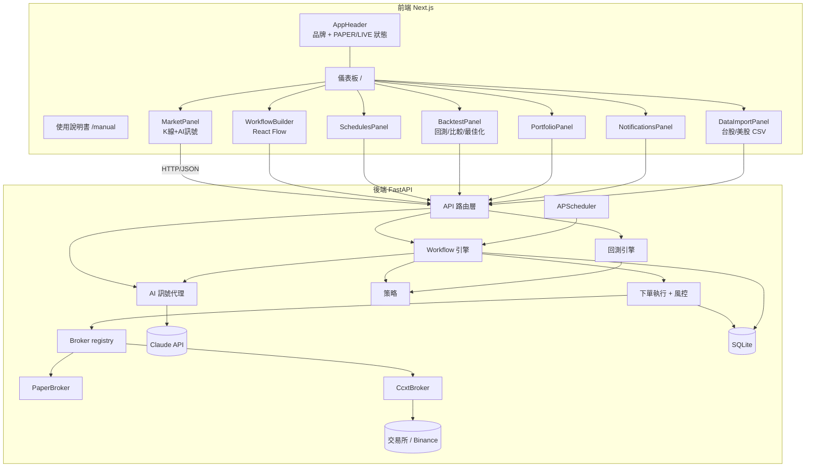
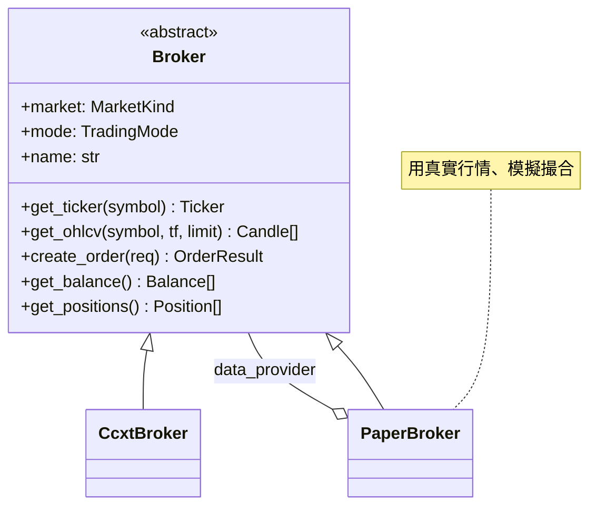
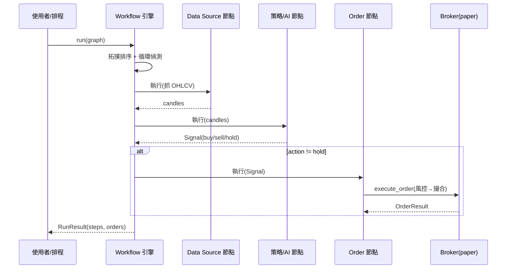
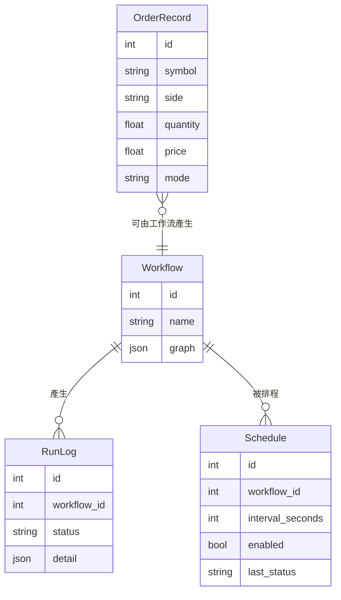

# 架構 / Architecture

## 總覽

平台分為 **後端 (FastAPI)** 與 **前端 (Next.js)**。後端的核心設計是一個 `Broker` 抽象介面,
作為「紙上交易 vs 真實交易」以及「不同市場(crypto / 台股 / 美股)」的**單一接縫**。
策略與 LLM 都輸出同一個 `Signal` 型別,因此工作流引擎可一視同仁地組合它們。

> 前端採統一的設計系統(Tailwind 設計 token、可複用的 `.card / .btn / .input / .badge / .skeleton`
> 元件層)。所有面板共用骨架載入、淡入動效與一致的多空語意色;頂部 `AppHeader` 顯示品牌與即時
> `PAPER / LIVE` 交易模式。

## 核心設計決策

### 1. Broker 抽象是唯一接縫
`backend/app/brokers/base.py` 定義 `Broker` ABC:`get_ticker` / `get_ohlcv` / `create_order` /
`get_balance` / `get_positions`。新增市場或切換 paper/live 都只需新增子類別 + 在 `registry.py`
註冊,**其餘程式不動**。

> 規劃中(尚未實作,需金鑰與外網):台股 **元大證券**、美股 **元大複委託 / Firstrade**。
> 三者都將實作為 `Broker` 子類別。Firstrade 無官方 API(僅社群非官方函式庫)。

### 2. 策略與 AI 同型輸出
`Signal(action, confidence, reason, source)`。指標策略(`strategies/`)與 LLM 代理
(`ai/signal_agent.py`)都回傳 `Signal`,所以工作流的 `strategy` 與 `ai_signal` 節點可互換。

### 3. 下單路徑單一化
`trading/execution.py:execute_order` 是手動下單(API)與工作流下單共用的唯一路徑:
解析成交價 → 風控 `RiskGuard.check` → `broker.create_order` → 寫入 `OrderRecord`。

### 4. Fail Loud
缺資料、外部錯誤、風控違規一律明確拋錯/回報(非靜默略過),符合 `CLAUDE.md`。
例如行情抓取失敗回 `502 NetworkError`;風控違規回 `422`;未實作市場回 `501`。

## 工作流執行流程

## 資料模型(SQLite)

## 技術選型理由

| 選擇 | 理由 |
| --- | --- |
| FastAPI | 非同步、型別、自動 OpenAPI 文件(`/docs`);交易/AI 生態以 Python 最成熟 |
| ccxt | 統一的加密貨幣交易所介面,支援 Binance testnet |
| `ta` | 技術指標函式庫,NumPy 2.x 相容(優於 `pandas-ta`) |
| anthropic SDK | Claude 結構化輸出產生交易訊號(`claude-opus-4-8`) |
| SQLModel | Pydantic + SQLAlchemy 合一,與 FastAPI 型別一致 |
| APScheduler | 行程內背景排程,讓工作流自動定時執行 |
| Next.js + React Flow | App Router + 節點式工作流編輯器;lightweight-charts 畫 K 線 |
