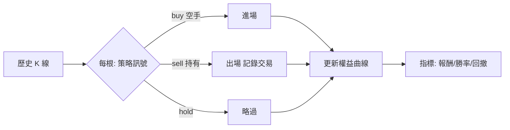
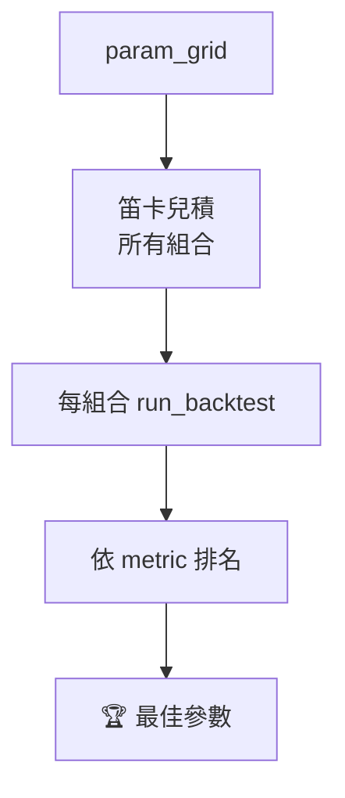

# 回測與最佳化 / Backtesting & Optimization

## 回測引擎(`backtest/engine.py`)
逐根 K 線模擬**做多**進出,完全離線、可重現。

流程:從第 2 根起,對「目前看到的歷史切片」呼叫策略 `generate`:
- `buy` 且空手:以 `position_fraction` 比例的現金買進
- `sell` 且持有:全數賣出,記錄一筆交易
- 策略資料不足(`ValueError`)視為 `hold`

每根記錄權益(現金+部位市值),計算回撤。

### 成交時點(M0.2,消除前視偏差)
訊號以「資料 ≤ `close[i]`」決策,但成交於**下一根開盤 `open[i+1]`**——**絕不**用觸發訊號的當根收盤成交(那是前視偏差:實際下單時無法知道當根會收在哪)。最後一根訊號無次根可成交→**不開新倉**(明確記為無交易)。權益於每根 `close[i]` 標記,反映「至該根開盤前已成交」建立的部位。

### 交易成本(M0.1)
**每一筆成交都套用 `trading/costs.py` 的 `CostModel`**(手續費、台股證交稅僅賣出、滑價),成本預設 **ON**——零成本的報酬數字是錯的。`run_backtest(..., market=..., cost_model=None)`:`cost_model=None` 用 `Settings` 設定值;測量毛報酬時傳 `CostModel.zero()`。`Trade.pnl` 為**淨額**,另有 `gross_pnl` 與 `cost` 明細。買→賣的已實現淨損益恆等於 `gross_pnl − buy_cost − sell_cost − sell_tax`。

### 風險/報酬指標(M0.3)
純函式在 `backtest/metrics.py`(可單元測試、`walk_forward` M0.4 共用)。年化用的 `periods_per_year` 由 `timeframe` 推導(如 `1h`→8766、`1d`→365.25);無風險利率由 `Settings.backtest_risk_free_rate` 設定(預設 0)。

`run_backtest(candles, strategy, starting_cash=100000, position_fraction=1.0, market=crypto, cost_model=None, timeframe="1h", risk_free_rate=None) -> BacktestResult`:

| 指標 | 說明 |
| --- | --- |
| `total_return_pct` / `buy_hold_return_pct` | 總報酬(已計入成本)/ 買入持有對照 |
| `cagr` | 年化複合成長率 |
| `annualized_volatility` | 年化波動度(每根報酬樣本標準差 × √ppy) |
| `sharpe` / `sortino` | 風險調整報酬(Sortino 只罰下檔波動) |
| `calmar` | CAGR / 最大回撤 |
| `profit_factor` | 毛利 / 毛損(無虧損交易時為 `null`) |
| `avg_win` / `avg_loss` | 平均獲利 / 平均虧損(淨) |
| `exposure_pct` | 持倉根數佔比 |
| `max_consecutive_losses` | 最長連續虧損次數 |
| `turnover` | 總成交名目 / 起始現金 |
| `num_trades` / `wins` / `win_rate` | 完成交易數 / 獲利筆數(淨) / 勝率(**不可作唯一排序依據**) |
| `max_drawdown_pct` | 權益曲線最大回撤 |
| `trades[]` / `equity_curve[]` | 交易明細(含 `gross_pnl`/`cost`)與權益曲線 |

## 多策略比較(`api/backtest.py` `/compare`)
同一段歷史一次跑完多個策略(只抓一次行情),依 `total_return_pct` 排名,回傳每策略摘要。
單一策略出錯不影響其他(該列帶 `error`)。

## 參數最佳化(`backtest/optimize.py`)
`grid_search(candles, strategy_name, param_grid, metric, max_combinations=200)`:
- 對 `param_grid`(如 `{fast:[5,10,15], slow:[20,30,40]}`)做笛卡兒積
- 每組合跑一次回測,依 `metric`(`total_return_pct` 或 `win_rate`)排名
- 組合數超過上限 fail loud;單組合出錯記為 `error` 列並排到最後

前端 `BacktestPanel` 提供 **Run / Compare all / Optimize** 三鈕;最佳化結果可一鍵「use」套回參數。

## 樣本外排序與 Walk-forward(M0.4,消除過擬合)

只在「全資料樣本內」挑報酬最高的參數會過擬合——那組數字在實盤通常崩掉。M0.4 引入兩個機制。

### `grid_search` 的 train/test 切分模式
`grid_search(..., split=True, oos_fraction=0.3, rank_metric="oos_sharpe")`:
- 把歷史切成「樣本內(IS)前段」與「樣本外(OOS)後段 = `oos_fraction`」。
- 每組參數在 **IS 與 OOS 各跑一次** `run_backtest`,`OptimizeRow` 同時揭露兩邊:`is_return_pct`、`oos_return_pct`、`is_oos_gap_pct`(= IS − OOS,正值代表 OOS 衰退,**不隱藏**)、`oos_sharpe`/`oos_sortino`/`oos_calmar`/`oos_return_over_maxdd`、`rank_score`。
- 排名依**風險調整後的 OOS 指標**(`rank_metric`,預設 `oos_sharpe`;另支援 `oos_sortino`/`oos_calmar`/`oos_return_over_maxdd`)——**絕不**用原始報酬。未知 `rank_metric` fail loud。
- 既有非切分模式(預設)維持向後相容:仍依原始 `metric`(`total_return_pct`/`win_rate`)在全資料排名。
- `rows[0]` 即 OOS 選出的最佳參數;`/api/backtest/optimize` 加 `split`/`oos_fraction`/`rank_metric`,前端「use」套用的就是這組。

### `backtest/validation.py` `walk_forward(...)`
`walk_forward(candles, strategy_name, param_grid, n_folds=4, metric="sharpe", anchored=True, ...)`:
- 把歷史切成 `n_folds` 段連續的 OOS 測試窗;每折在其**之前**的資料(anchored:從頭累積;rolling:僅前一段)選 IS 最佳參數,再於該折 OOS 窗評分。
- 回傳 `WalkForwardReport`:每折 `FoldResult`(`best_params`、`is_metric`、`oos_metric`、`oos_return_pct`、窗界 index 等)與 `aggregate_oos_metric`(各折 OOS 指標平均)。
- 選參指標為風險調整後(預設 Sharpe);未知 `metric`、`n_folds<2`、資料不足皆 fail loud。

**驗收(已寫成測試):** 構造一組「IS 極佳、OOS 失敗」的參數,在 OOS 排序下**不會排第 1**(`backend/app/tests/test_optimize.py::test_overfit_combo_does_not_rank_first`、`test_validation.py`)。
