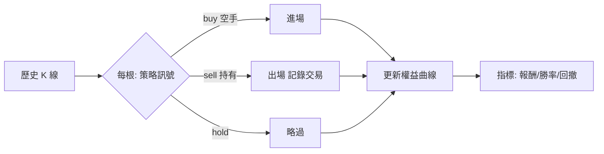
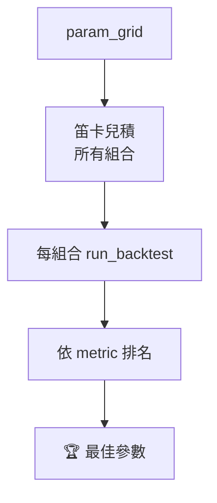

# 回測與最佳化 / Backtesting & Optimization

## 回測引擎(`backtest/engine.py`)
逐根 K 線模擬**做多**進出,完全離線、可重現。

流程:從第 2 根起,對「目前看到的歷史切片」呼叫策略 `generate`:
- `buy` 且空手:以 `position_fraction` 比例的現金買進
- `sell` 且持有:全數賣出,記錄一筆交易
- 策略資料不足(`ValueError`)視為 `hold`

每根記錄權益(現金+部位市值),計算回撤。

### 交易成本(M0.1)
**每一筆成交都套用 `trading/costs.py` 的 `CostModel`**(手續費、台股證交稅僅賣出、滑價),成本預設 **ON**——零成本的報酬數字是錯的。`run_backtest(..., market=..., cost_model=None)`:`cost_model=None` 用 `Settings` 設定值;測量毛報酬時傳 `CostModel.zero()`。`Trade.pnl` 為**淨額**,另有 `gross_pnl` 與 `cost` 明細。買→賣的已實現淨損益恆等於 `gross_pnl − buy_cost − sell_cost − sell_tax`。

`run_backtest(candles, strategy, starting_cash=100000, position_fraction=1.0, market=crypto, cost_model=None) -> BacktestResult`:

| 指標 | 說明 |
| --- | --- |
| `total_return_pct` | 期末權益 / 起始現金 - 1(已計入成本) |
| `buy_hold_return_pct` | 買入持有對照(末價/首價) |
| `num_trades` / `wins` / `win_rate` | 完成交易數 / 獲利筆數(淨) / 勝率 |
| `max_drawdown_pct` | 權益曲線最大回撤 |
| `trades[]` / `equity_curve[]` | 交易明細(含 `gross_pnl`/`cost`)與權益曲線 |

## 多策略比較(`api/backtest.py` `/compare`)
同一段歷史一次跑完多個策略(只抓一次行情),依 `total_return_pct` 排名,回傳每策略摘要。
單一策略出錯不影響其他(該列帶 `error`)。

## 參數最佳化(`backtest/optimize.py`)
`grid_search(candles, strategy_name, param_grid, metric, max_combinations=200)`:
- 對 `param_grid`(如 `{fast:[5,10,15], slow:[20,30,40]}`)做笛卡兒積
- 每組合跑一次回測,依 `metric`(`total_return_pct` 或 `win_rate`)排名
- 組合數超過上限 fail loud;單組合出錯記為 `error` 列並排到最後

前端 `BacktestPanel` 提供 **Run / Compare all / Optimize** 三鈕;最佳化結果可一鍵「use」套回參數。
