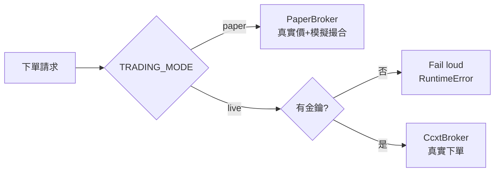

# 設定與安全 / Configuration & Safety

複製 `.env.example` 為 `.env` 後填入。`.env` 已被 git 忽略,**絕不提交**。

## 環境變數

| 變數 | 預設 | 說明 |
| --- | --- | --- |
| `TRADING_MODE` | `paper` | `paper`(模擬,安全)或 `live`(真實下單) |
| `ANTHROPIC_API_KEY` | — | AI 訊號/解釋節點所需 |
| `AI_MODEL` | `claude-opus-4-8` | 預設模型;高頻訊號可改 `claude-sonnet-4-6` 省成本 |
| `BINANCE_API_KEY` / `BINANCE_API_SECRET` | — | 真實加密貨幣交易;空白則只用公開行情 |
| `BINANCE_TESTNET` | `true` | `true` 將真實下單導向 Binance 測試網 |
| `YUANTA_API_KEY` / `YUANTA_API_SECRET` | — | 台股 元大(規劃中) |
| `FIRSTRADE_USERNAME` / `FIRSTRADE_PASSWORD` | — | 美股 Firstrade(規劃中,非官方 API) |
| `DATABASE_URL` | `sqlite:///./trade_flow.db` | 資料庫連線 |
| `NOTIFY_WEBHOOK_URL` | — | 選填:下單/訊號通知的外送 webhook(如 Slack/Discord);空白則只用站內通知 |
| `PAPER_STARTING_CASH` | `100000` | 紙上交易起始現金 |
| `PAPER_QUOTE_ASSET` | `USDT` | 紙上交易計價資產 |
| `API_TOKEN` | — | `/api/*` 的 Bearer 權杖;**空白 = 關閉驗證(開放)**,後端會印警告。正式部署務必設定 |
| `API_CORS_ORIGINS` | `http://localhost:3000` | 允許的 CORS 來源(逗號分隔);取代舊有的 `"*"` |
| `NEXT_PUBLIC_API_BASE_URL` | `http://localhost:8000` | 前端呼叫後端的位址 |
| `NEXT_PUBLIC_API_TOKEN` | — | 前端送出的 Bearer 權杖,需等於 `API_TOKEN`。注意 `NEXT_PUBLIC_*` 會暴露給瀏覽器 |

## 交易模式

## 安全閘門(多層)
1. **預設 paper**:`TRADING_MODE` 預設模擬,需明確設 `live` 才會真實下單。
2. **金鑰檢查**:`CcxtBroker.create_order` 無金鑰直接拋錯(不會假裝成功)。
3. **風控**:`trading/risk.py` 在送單前檢查單筆金額上限與部位總值上限,違規回 `422`。
4. **排程下限**:排程間隔最少 5 秒,避免過度呼叫交易所。
5. **機密只走環境變數**:不寫死於程式;`.env` 被忽略。
6. **API Bearer 驗證 (M0.7)**:所有 `/api/*` 需 `Authorization: Bearer <API_TOKEN>`,否則回 `401`;`GET /health` 開放。`backend/app/api/deps.py` 在請求時讀取 `settings.api_token`。
7. **CORS 白名單 (M0.7)**:`allow_origins` 改由 `API_CORS_ORIGINS` 設定,移除原本的 `"*"`。

### API 驗證:空權杖行為(明確設計決定)
`API_TOKEN` 留空時,**驗證關閉(完全開放)**,以便本機開發與既有測試套件免設定即可運作;此時後端
**每次請求都會印出 loud warning**。正式或任何對外網路部署 **務必設定強隨機 `API_TOKEN`**,並讓前端
`NEXT_PUBLIC_API_TOKEN` 對應。

### 交易所金鑰最小權限(強烈建議)
- **停用提領 (withdrawals DISABLED)**:交易所金鑰一律關閉提幣權限,避免金鑰外洩造成資金被提走。
- **IP allowlist**:將金鑰綁定後端伺服器固定 IP。
- **分權金鑰**:行情用 **唯讀 (read-only)** 金鑰;下單另用 **僅限交易 (trade-only)、鎖死** 的金鑰。
- `NEXT_PUBLIC_*` 會打包進前端、對瀏覽器可見,因此 `NEXT_PUBLIC_API_TOKEN` 不可視為機密;真正的防線是
  上述交易所金鑰限制 + CORS 白名單 + 後端 Bearer 驗證的縱深防禦。

> 真實交易具資金風險。上線前務必先以 `paper` 與回測充分驗證策略。
