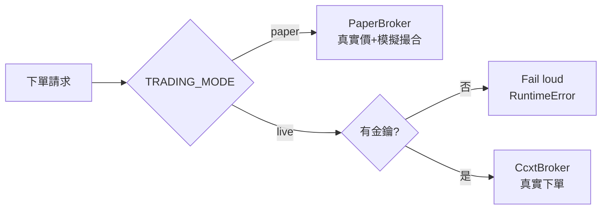

# 設定與安全 / Configuration & Safety

複製 `.env.example` 為 `.env` 後填入。`.env` 已被 git 忽略,**絕不提交**。

## 環境變數

| 變數 | 預設 | 說明 |
| --- | --- | --- |
| `TRADING_MODE` | `paper` | `paper`(模擬,安全)或 `live`(真實下單) |
| `ANTHROPIC_API_KEY` | — | AI 訊號/解釋節點所需 |
| `AI_MODEL` | `claude-opus-4-8` | 預設模型;高頻訊號可改 `claude-sonnet-4-6` 省成本 |
| `BINANCE_API_KEY` / `BINANCE_API_SECRET` | — | 真實加密貨幣交易;空白則只用公開行情 |
| `BINANCE_TESTNET` | `true` | `true` 將真實下單導向 Binance 測試網 |
| `YUANTA_API_KEY` / `YUANTA_API_SECRET` | — | 台股 元大(規劃中) |
| `FIRSTRADE_USERNAME` / `FIRSTRADE_PASSWORD` | — | 美股 Firstrade(規劃中,非官方 API) |
| `DATABASE_URL` | `sqlite:///./trade_flow.db` | 資料庫連線 |
| `PAPER_STARTING_CASH` | `100000` | 紙上交易起始現金 |
| `PAPER_QUOTE_ASSET` | `USDT` | 紙上交易計價資產 |
| `NEXT_PUBLIC_API_BASE_URL` | `http://localhost:8000` | 前端呼叫後端的位址 |

## 交易模式

## 安全閘門(多層)
1. **預設 paper**:`TRADING_MODE` 預設模擬,需明確設 `live` 才會真實下單。
2. **金鑰檢查**:`CcxtBroker.create_order` 無金鑰直接拋錯(不會假裝成功)。
3. **風控**:`trading/risk.py` 在送單前檢查單筆金額上限與部位總值上限,違規回 `422`。
4. **排程下限**:排程間隔最少 5 秒,避免過度呼叫交易所。
5. **機密只走環境變數**:不寫死於程式;`.env` 被忽略。

> 真實交易具資金風險。上線前務必先以 `paper` 與回測充分驗證策略。
