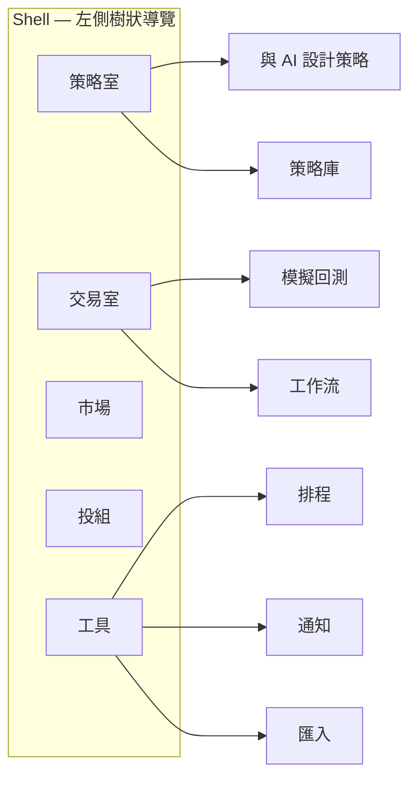
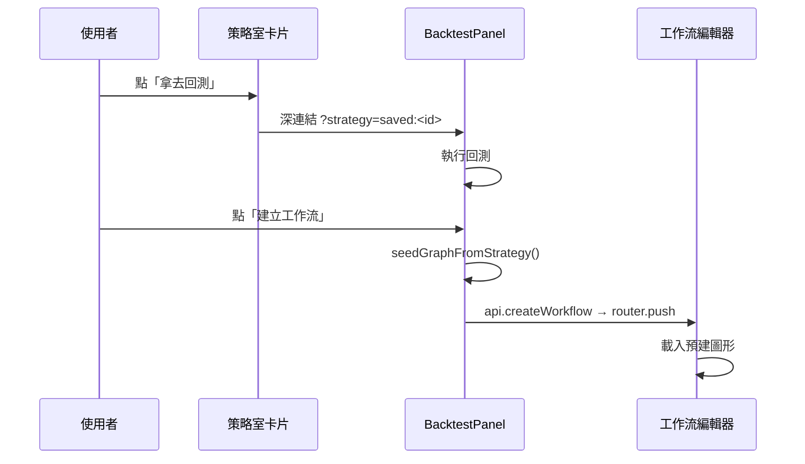

# 前端 / Frontend

> 以 Next.js 14 App Router 建構。本文記錄本次大改版（exec-ux-overhaul）已出貨的所有前端功能。
> 視覺系統與配色規則請以 [`DESIGN.md`](../DESIGN.md) 為準。

## 目錄

1. [資訊架構 — 兩個房間](#資訊架構--兩個房間)
2. [左側樹狀導覽](#左側樹狀導覽)
3. [首頁引導卡 Onboarding](#首頁引導卡-onboarding)
4. [共用圖表 PriceChart](#共用圖表-pricechart)
5. [語言層 — labels / Term](#語言層--labels--term)
6. [市場行情 MarketPanel](#市場行情-marketpanel)
7. [回測 UX BacktestPanel](#回測-ux-backtestpanel)
8. [策略→回測→工作流 串聯](#策略回測工作流-串聯)

---

## 資訊架構 — 兩個房間

產品以「兩個房間」劃分功能：

| 房間 | 路徑 | 定位 |
|------|------|------|
| 策略室 Strategy Lab | `/strategy-lab` | 與 AI 對話、生成策略、存入策略庫 |
| 交易室 Trading Room | `/trading-room/backtest`、`/trading-room/workflow` | 回測、工作流執行、排程 |

另有橫跨兩室的輔助頁面：市場行情 `/market`、投組 `/portfolio`，以及歸入「工具」群組的排程、通知、資料匯入。

`/docs` 為獨立亮色閱讀 Portal（`[data-surface="docs"]` scope），與主 App 深色終端機風格分流。



---

## 左側樹狀導覽

**相關檔案：** `lib/nav.ts`、`components/shell/TreeNav.tsx`、`components/shell/StrategyLibraryTree.tsx`、`components/shell/AppShell.tsx`

`lib/nav.ts` 中的 `NAV` 陣列是**導覽單一來源**，結構如下：

```
策略室  Strategy Lab          ← ai: true → accent 點
  └─ 與 AI 設計策略  Design with AI
  └─ 策略庫  Strategy Library
       └─ [已存策略，動態注入]   ← StrategyLibraryTree 即時查詢
交易室  Trading Room
  └─ 模擬回測  Backtest
  └─ 工作流  Workflow
市場    Market
投組    Portfolio
工具    Tools
  └─ 排程 / 通知 / 匯入
```

`TreeNav` 讀取 `NAV` 後渲染父列 + 子列（縮排 16px + 1px `--border` 導線）。活躍葉節點獲得 `border-accent`（2px 青色左邊框）+ `bg-accent-dim` 底色；父節點無連結時 `href="#"`。`實際下單`（live）葉節點改用 `border-live`、`text-live`（粉紅危險色）。

`StrategyLibraryTree` 在「策略庫」葉節點下方動態展開，以 `api.listSavedStrategies` 取策略庫清單（`staleTime: 60_000`；fetch 失敗顯示「策略庫載入失敗」）。每筆策略的 `href` 為 `/trading-room/backtest?strategy=saved:<id>`，點擊即深連結至回測並預填策略。

**RWD：**
- ≥ 1280px：240px 固定展開樹
- 768–1279px：64px icon rail（`--nav-w-rail`），hover/flyout 顯示標籤
- < 768px：off-canvas drawer，漢堡按鈕觸發，`Esc` 關閉，選單後自動收闔（`onNavigate` callback）

---

## 首頁引導卡 Onboarding

**相關檔案：** `components/Onboarding.tsx`、`components/HomeDashboard.tsx`

首次造訪首頁，頁面頂端出現「三步上手」引導卡（三格 grid，各步驟可點連結跳頁）。步驟文案集中在 `lib/labels.ts` 的 `L.onboarding`。

**狀態持久化：** 使用者點「知道了」後寫入 `localStorage.atf-onboarding-dismissed = "1"`，再訪不再顯示。SSR/CSR hydration 安全：`show` 預設 `false`，`useEffect` mount 後才讀 `localStorage`，避免閃爍。

引導卡顯示期間，「策略室」步驟的卡片有 `bg-accent` 小點（cyan 僅代表 AI/自動化身份）。

---

## 共用圖表 PriceChart

**相關檔案：** `components/PriceChart.tsx`、`lib/chart-helpers.ts`

`PriceChart` 是全站 K 線 / 行情圖的**統一元件**，基於 `lightweight-charts` v4 封裝。

### Props

| Prop | 型別 | 說明 |
|------|------|------|
| `candles` | `Candle[]` | 歷史 OHLCV |
| `markers` | `ChartMarker[]` | 買/賣/AI 標記 |
| `overlays` | `Overlay[]` | SMA/EMA 疊加均線 |
| `volume` | `boolean` | 是否顯示成交量子圖（預設 `true`） |
| `live` | `LiveConfig \| null` | 非 null 時啟用即時輪詢 |
| `onCrosshairMove` | `(OHLCV \| null) => void` | 十字準星 OHLCV 回拋 |

### 圖表建立策略

`createChart` 只在 mount（或 `height`/`volume`/`crosshair` 改變）時建立一次。`candles` 更新時呼叫 `cs.setData`（不重建圖表），因此不會丟失縮放位置或產生閃爍。`ResizeObserver` 負責自動跟隨容器寬度。

顏色完全由 CSS 自訂屬性取得（`cssVar("--up", "#34D399")`），因此 `data-market="tw"` 翻轉後 `--up`/`--down` 自動生效，圖表隨之更新。

### 即時輪詢（live 模式）

`live` prop 不為 null 時，以 `@tanstack/react-query` 輪詢：

```
queryKey: ["price-live", symbol, timeframe, market]
refetchInterval: max(1000, intervalMs ?? 3000)
refetchIntervalInBackground: false   // 分頁失焦自動暫停
```

每次 fetch 取最新 2 根 K 線，以 `series.update()`（非 `setData`）逐根更新，不重設視圖。最新收盤價與前次比較後觸發 `flash`（up/down），徽章顯示 200ms 閃色後復原。

> **「即時」注意：** 現為輪詢；WebSocket 為未來規劃。

### 買賣標記

`lib/chart-helpers.ts` 的 `tradesToMarkers(trades)` 將每筆交易轉為 entry（▲買，`belowBar`）+ exit（▼賣，`aboveBar`，附報酬 %）兩個 `ChartMarker`，輸出依時間排序（`setMarkers` 需求）。

AI 訊號在 `MarketPanel` 中以最後一根 K 線的 timestamp 注入一個額外標記（action = "hold" 時不疊）。

### SMA 疊加均線

`overlays` 陣列中每個 `{ id, type, period, color }` 在圖上加一條 `addLineSeries`。`color` 支援 CSS 變數字串（如 `"--text"`）或 hex。均線計算在元件內完成（`sma()` 純函式）。疊加層在 `overlays` / `candles` 改變時卸除再重建，避免孤立線段。

### CandleChart

`components/CandleChart.tsx` 是薄包裝：`volume={false}`，保留歷史 API 相容性。

---

## 語言層 — labels / Term

**相關檔案：** `lib/labels.ts`、`components/Term.tsx`

### `L` 物件（中文 copy）

所有頁面 UI 文案集中於 `lib/labels.ts` 的 `L` const 物件，依模組分組（`market`、`backtest`、`metrics`、`linking`、`nav`、`onboarding`、`portfolio`、`schedules`、`notifications`、`dataImport`）。金融術語（Sharpe、CAGR 等）保留英文縮寫，白話解讀放 `GLOSSARY`。

### `GLOSSARY`（指標白話）

`GLOSSARY: Record<string, string>` 收錄所有回測指標的一句白話說明，供 `<Term>` 元件使用。

### `<Term>` 元件

```tsx
<Term k="sharpe">{L.metrics.sharpe}</Term>
```

若 `GLOSSARY[k]` 存在，在標籤旁渲染一個 `?` 圓鈕；hover / focus-within 顯示純 CSS tooltip（`w-56`，`bg-surface-3`，`z-30`）。不引入第三方 tooltip 套件。

---

## 市場行情 MarketPanel

**相關檔案：** `components/MarketPanel.tsx`、`lib/market-stats.ts`

### 功能清單

| 功能 | 說明 |
|------|------|
| 即時 K 線 | `PriceChart` live 模式，crypto 每 3 秒輪詢 |
| 搜尋標的 | `<input list="market-symbols">` + `<datalist>`（常用標的），自由輸入 |
| 市場切換 | crypto / 台股 / 美股；台股、美股顯示「離線資料（CSV）」標籤 |
| 暫停 | 僅 crypto 顯示「暫停」按鈕，paused = true 時停止 refetch |
| 24h 統計 | 由 `lib/market-stats.ts` 的 `deriveStats(candles, barsPer24h(timeframe))` 從 OHLCV 推算（24h 漲跌絕對值 / 百分比 / 高 / 低）；後端 Ticker 只回現價，不偽造不存在的欄位 |
| AI 訊號標記 | 點「AI 訊號」後呼叫 `api.aiSignal`，回傳結果疊在最後一根 K 的標記上；hold 不疊 |
| URL 持久化 | `symbol`、`timeframe`、`market` 以 `router.replace` 寫入 query string，重整後恢復 |

**market-stats 設計：** `barsPer24h` 依 timeframe 回傳近似根數（如 `"1h"` → 24）；`deriveStats` 取最後 N 根估算，誠實標明「非真實 24h Ticker」。

---

## 回測 UX BacktestPanel

**相關檔案：** `components/BacktestPanel.tsx`

### 控制列

```
市場 | 代號 | 週期 | [最近N根 ⇄ 日期區間] | 策略(含策略庫) | 參數 | 執行回測 | 進階分析 ▾
```

- **日期區間模式**：切換後控制列改為兩個 `<input type="date">`，預設 last 1y → today；`最近 N 根` 模式顯示 200/500/1000 bars 下拉。
- **策略選單**：`<optgroup>` 分「內建策略」與「策略庫（策略室）」；選到已存策略時顯示 `策略庫 · 預設參數` 青色徽章，並清空參數欄（由後端 StrategyDef 管理）。

### 進階分析（collapsible）

展開後顯示三個操作按鈕各附一行描述文字：

| 操作 | 說明標籤 |
|------|----------|
| 比較全部策略 | 同條件跑四個內建策略並排名 |
| 參數最佳化（`<Term k="optimize">`） | 掃描網格；以 OOS 指標排名避免過擬合 |
| 樣本外驗證（`<Term k="walk_forward">`） | Walk-forward k 折檢查穩健度 |

已存策略（`isSaved`）停用最佳化/樣本外（後端僅支援內建策略），顯示提示文字。

### 結果頁籤（只顯示已執行的頁籤）

```
概覽 | 交易明細 | 比較 | 最佳化 | 樣本外
```

頁籤只有在對應資料存在時才渲染；執行動作後自動切換到對應頁籤。

#### 概覽頁（overview）

1. **建立工作流** 按鈕（青色外框）→ 觸發 `buildWorkflow()`（見下節）
2. **4 個主要指標卡**（`MetricCard` + `<Term>`）：總報酬（含 Buy&Hold / 超額 sub-row）、最大回撤、Sharpe、勝率；依健康度着色（`--up`/`--down`/neutral）。
3. **更多指標 toggle**：CAGR、Sortino、Calmar、獲利因子、年化波動、曝險時間、週轉率、最大連虧、交易數，全部帶 `<Term>` tooltip。
4. **無交易提示**：`num_trades === 0` 時顯示 `--warning` 色警告框。
5. **K 線圖**（`PriceChart`）：疊加回測期間的買賣標記（`tradesToMarkers`）+ SMA 均線（ma_cross 策略時自動加 fast/slow 兩條）。
6. **權益曲線**（`EquityChart`）。

#### 最佳化頁（optimize）

以**樣本外報酬（OOS Return）**為主欄，旁列 IS→OOS Gap（過擬合警示，差距大顯示 `--warning` 色）、OOS Sharpe、Max DD、勝率。冠軍列顯示 🏆。「use」按鈕套用參數後自動切回概覽頁。

---

## 策略→回測→工作流 串聯

無全域狀態管理，完全依賴 **URL query + 現有 API**。

### 策略室 → 回測（拿去回測）

`components/strategy/` 中已存策略卡的「拿去回測」按鈕（`L.linking.sendToBacktest`）生成深連結：

```
/trading-room/backtest?strategy=saved:<id>&symbol=<s>&timeframe=<tf>&market=<m>
```

`BacktestPanel` 的 `useEffect` 解析 query string，待 `listSavedStrategies` 回應後比對 id，確認存在才套用（避免 select 尚未渲染選項時空賦值）。套用後以 `appliedQuery.current = true` 防止重複觸發。

### 回測 → 工作流（建立工作流）

回測概覽頁的「建立工作流 →」按鈕呼叫：

```typescript
// lib/workflow-seed.ts
seedGraphFromStrategy({ strategyId, strategyName, symbol, market, timeframe })
// 生成 data_source → strategy → order 三節點 WorkflowGraph
```

圖形由 `api.createWorkflow(name, graph)` 持久化至後端，再以 `router.push("/trading-room/workflow?workflow=<id>")` 導航到工作流編輯器並自動載入。



---

## 誠實說明（目前限制）

| 項目 | 現況 |
|------|------|
| 「即時」行情 | 輪詢（polling），非 WebSocket；WebSocket 為未來規劃 |
| 台股 / 美股 | 離線 CSV 資料，不偽裝即時；MarketPanel 顯示「離線資料（CSV）」標籤 |
| 24h 統計 | 從 OHLCV 推算（非後端 Ticker），在標籤旁誠實說明 |
