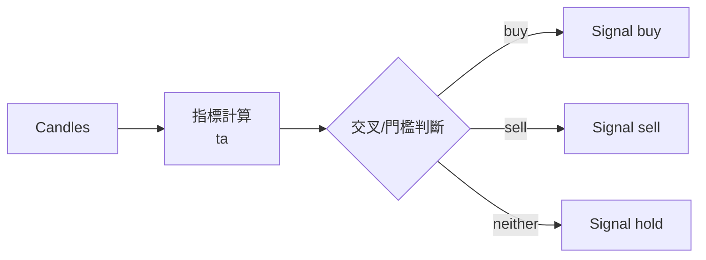

# 策略與指標 / Strategies & Indicators

## 指標包裝(`strategies/indicators.py`)
薄包裝 [`ta`](https://github.com/bukosabino/ta) 函式庫(非手刻,且 NumPy 2.x 相容):
- `candles_to_df(candles)` → 時間索引 OHLCV DataFrame(空資料 fail loud)
- `sma(close, window)`、`rsi(close, window=14)`
- `macd(close, window_slow=26, window_fast=12, window_sign=9)` → (macd, signal, hist)
- `bollinger(close, window=20, window_dev=2)` → (upper, mid, lower)

## 策略介面
`strategies/base.py`:`Strategy.generate(candles) -> Signal`。資料不足時拋 `ValueError`(fail loud)。
所有策略輸出共用的 `Signal(action, confidence, reason, source)`。

## 4 種策略

| 名稱 | 檔案 | 邏輯 | 參數 |
| --- | --- | --- | --- |
| `ma_cross` | `ma_cross.py` | 快線上穿慢線→買;下穿→賣 | `fast=10, slow=20` |
| `rsi` | `rsi.py` | RSI ≤ 超賣→買;≥ 超買→賣 | `window=14, oversold=30, overbought=70` |
| `macd` | `macd.py` | MACD 線上穿訊號線→買;下穿→賣 | `window_fast=12, window_slow=26, window_sign=9` |
| `bollinger` | `bollinger.py` | 收盤跌破下軌→買;突破上軌→賣 | `window=20, window_dev=2` |



## 註冊表(`strategies/registry.py`)
```python
STRATEGIES = {"ma_cross":..., "rsi":..., "macd":..., "bollinger":...}
build_strategy(name, params) -> Strategy
```
工作流的 `strategy` 節點、回測、比較、最佳化都透過此註冊表建立策略,新增策略只需在此登記。

## 新增策略步驟
1. 在 `strategies/` 新增類別,繼承 `Strategy`,實作 `generate`,設定 `name`。
2. 在 `registry.py` 的 `STRATEGIES` 登記。
3. 前端 `lib/strategies.ts` 加入 `STRATEGY_PARAMS`(與 `OPTIMIZE_GRID`)。
4. 加上商業邏輯測試(見 `tests/test_strategies.py` / `test_more_strategies.py`)。

> AI 訊號(`ai/signal_agent.py`)輸出同樣是 `Signal`,在工作流中與指標策略可互換。
