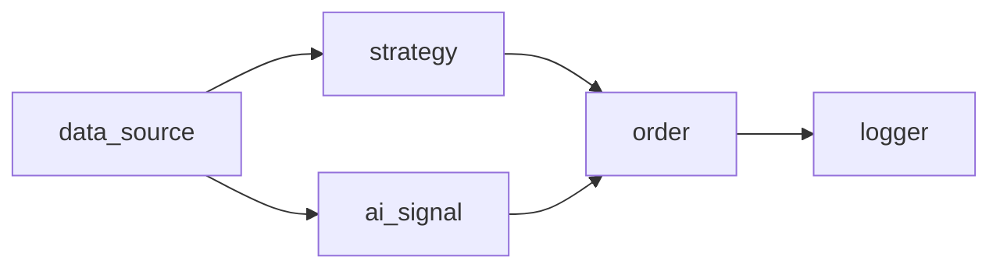
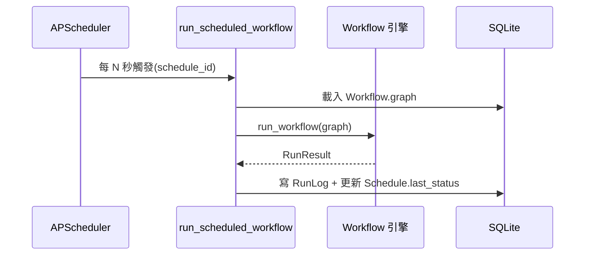

# 工作流引擎 / Workflow Engine

工作流是一張**有向無環圖 (DAG)**:節點產生輸出,沿邊傳給下游。前端的 React Flow 編輯器
與後端 `WorkflowGraph` schema 一一對應。

## 節點型別(`workflow/schema.py` `NodeType`)

| 型別 | 輸入 | 輸出 | params |
| --- | --- | --- | --- |
| `data_source` | — | `Candle[]` | `symbol, market, timeframe, limit` |
| `strategy` | candles | `Signal` | `name` + 該策略參數 |
| `ai_signal` | candles | `Signal` | `symbol?, model?` |
| `risk_exit` | candles | `Signal`(停損/停利→sell,否則 hold) | `stop_loss_pct, take_profit_pct, symbol?, market?` |
| `order` | Signal | `OrderResult`(hold 則 None) | `quantity, symbol?, market?` |
| `logger` | 任意 | 透傳 | — |

## 執行(`workflow/engine.py`)
1. `_topological_order`:拓撲排序,偵測重複 id、未知邊、循環(皆 fail loud → `RunResult.error`)。
2. 依序執行每個節點,輸入為其前驅節點的輸出。
3. 每個節點輸出做摘要存入 `steps`;`order` 節點的 `OrderResult` 收進 `orders`(僅 order 節點計入,
   避免 logger 透傳重複計算)。
4. 任一節點丟例外 → 停止並回報是哪個節點失敗(fail loud)。

`RunResult { status, steps[], orders[], error }`。

## 節點執行器(`workflow/nodes.py`)
- `RunContext`:跨節點暫存(如 data_source 設定的 `symbol`/`market`,供 order 節點預設)+ DB session。
- `_first_candles` / `_first_signal`:從上游輸入取出對應型別,缺少則 fail loud。
- `order` 節點呼叫共用的 `trading/execution.execute_order`(含風控)。

## 自動執行(排程)
已儲存的工作流可由 `Schedule` 綁定間隔,APScheduler 定時觸發 `run_scheduled_workflow`,
重用同一個引擎,把結果寫入 `RunLog` 並更新排程狀態。見 [backend.md](./backend.md) `scheduler/`。

## API
建立/執行/排程見 [api-reference.md](./api-reference.md) 的 Workflows 與 Schedules 段。
