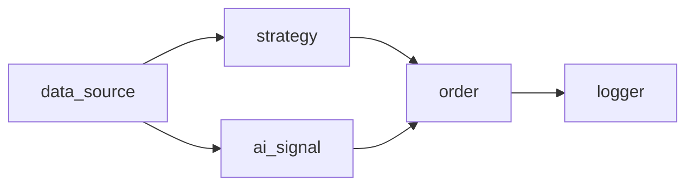
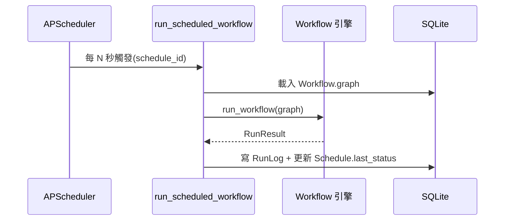

# 工作流引擎 / Workflow Engine

工作流是一張**有向無環圖 (DAG)**:節點產生輸出,沿邊傳給下游。前端的 React Flow 編輯器
與後端 `WorkflowGraph` schema 一一對應。

## 節點型別(`workflow/schema.py` `NodeType`)

| 型別 | 輸入 | 輸出 | params |
| --- | --- | --- | --- |
| `data_source` | — | `Candle[]` | `symbol, market, timeframe, limit` |
| `strategy` | candles | `Signal` | `name` + 該策略參數 |
| `ai_signal` | candles | `Signal` | `symbol?, model?` |
| `risk_exit` | candles | `Signal`(停損/停利→sell,否則 hold) | `stop_loss_pct, take_profit_pct, symbol?, market?` |
| `order` | Signal | `OrderResult`(無動作則 None) | `quantity, symbol?, market?` |
| `logger` | 任意 | 透傳 | — |
| `condition` | candles | `Signal`(門檻成立→buy,否則 hold) | `source(預設 close), operator(>,>=,<,<=,==,!=), value` |
| `combine` | 多個 Signal | 單一 `Signal` | `mode(AND/OR/weighted)`, OR 用 `bias`, weighted 用 `weights{source:w}, epsilon` |
| `branch` | Signal + candles | `Signal`(條件成立→透傳上游 Signal,否則 hold) | 同 `condition` |

### 多 Signal 與「不再靜默丟棄」(M2.1)
- 期望單一 Signal 的節點(如 `order`)若收到**多個** Signal 會 **fail loud**(`_only_signal` 拋錯,提示改接 `combine`)——取代舊的 `_first_signal` 靜默取首個的 bug。
- 單一上游 Signal 仍直通(passthrough)不變。

### `combine` 合併語意
- **AND(共識)**:所有 Signal 必須一致同向(全 buy→buy、全 sell→sell)才動作;任何不一致或出現 hold → `hold`。confidence 取一致 Signal 的**最小值**(最弱環節)。
- **OR(任一動作優先)**:任一 buy/sell 勝過 hold;若同時出現 buy 與 sell 衝突,由可設定的 `bias`(預設 `buy`)決定勝方。confidence 取勝方 Signal 的**最大** confidence。
- **weighted(加權投票)**:buy 加 `+confidence*weight`、sell 加 `-confidence*weight`、hold 不計;`weight` 由 `weights`(以 Signal 的 `source` 為鍵,預設 1.0)提供。淨值 > `epsilon`→buy、< `-epsilon`→sell、否則 `hold`。confidence = `min(1, |淨值| / 總權重)`。

## 執行(`workflow/engine.py`)
1. `_topological_order`:拓撲排序,偵測重複 id、未知邊、循環(皆 fail loud → `RunResult.error`)。
2. 依序執行每個節點,輸入為其前驅節點的輸出。
3. 每個節點輸出做摘要存入 `steps`;`order` 節點的 `OrderResult` 收進 `orders`(僅 order 節點計入,
   避免 logger 透傳重複計算)。
4. 任一節點丟例外 → 停止並回報是哪個節點失敗(fail loud)。

`RunResult { status, steps[], orders[], error }`。

## 節點執行器(`workflow/nodes.py`)
- `RunContext`:跨節點暫存(如 data_source 設定的 `symbol`/`market`,供 order 節點預設)+ DB session + `run_id`(本次邏輯執行的識別碼,預設隨機;排程器傳入「每個 tick 固定」的值)。
- `_first_candles`:從上游輸入取出 candles,缺少則 fail loud。
- `_only_signal`:取出**唯一**上游 Signal;缺少或出現多個皆 fail loud(多個須先接 `combine`)。`combine` 改用 `_signals` 取全部 Signal 後合併。
- `order` 節點呼叫共用的 `trading/execution.execute_order`(含風控)。
- **目標部位語意(M0.5)**:訊號代表「目標」而非動作——buy⇒持有 `quantity` 單位、sell⇒出清(0)、hold⇒不動作。節點讀取現有持倉、只交易差額(僅做多/出清,不放空);已達目標則不下單,故重複 tick 天然冪等。
- **冪等鍵(M0.5)**:每筆下單以 `sha1("{run_id}:{node_id}")` 推導 `client_order_id` 傳入 `execute_order`;同一 `run_id` 重跑會得到相同鍵 → 跳過重複下單。排程的同一 tick 重試共用同鍵,下一 tick 取得新鍵。

## 自動執行(排程)
已儲存的工作流可由 `Schedule` 綁定間隔,APScheduler 定時觸發 `run_scheduled_workflow`,
重用同一個引擎,把結果寫入 `RunLog` 並更新排程狀態。見 [backend.md](./backend.md) `scheduler/`。

## API
建立/執行/排程見 [api-reference.md](./api-reference.md) 的 Workflows 與 Schedules 段。
